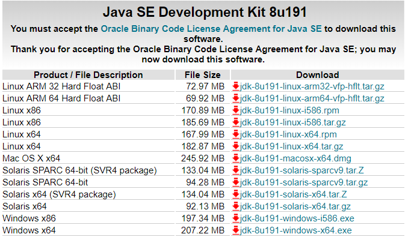

## IDEA Intellij Setup for Scala/Spark Application

Software preparation

1. Install IDEA Intellij from https://www.jetbrains.com/idea/download/ 

2. Install Java 1.8 SDK from https://www.oracle.com/technetwork/java/javase/downloads/jdk8-downloads-2133151.html

   - When installing Java JDK, try to avoid space in the folder name. for example, you can use c:\Java\SDK as installation folder.


    


3. Install Maven from https://maven.apache.org/download.cgi. 

4. Install Scala 2.11.8 from https://downloads.lightbend.com/scala/2.11.8/scala-2.11.8.msi. 


Once all preparation is done, we will start to create project in IDEA Intellij. 
​	1. 
Open Intellij and create a Maven project.

​            

```
1. 
```

Choose Project SDK as Java 1.8.
​	2. 
Choose a archetype as project folder template. For example, scala-archetype-simple

​            

```
1. 
```

Name your GroupId and ArtifactId

```
	* 
```

GroupId: group name, for example, com.micron.f10ds
​		* 
ArtifactId: unique jar name, for example, my-first-scala-app

​            

```
1. 
```

If you do this inside Micron environment, please update your maven settings.xml (for example, C:\Users\TAN PENG\.m2\settings.xml) to https://github.com/NUSTemple/training/blob/master/templates/settings.xml to replace the maven repo and add proxy.
​	2. 
If project is created successfully, you should see below folder structure. 

```
	* 
```

.idea folder is used by IDEA intellij only. it is not related to your project code
​		* 
src folder is used to store your functional code
​		* 
test folder is used to store your test code
​		* 
pom.xml is used for maven configuration. This file will use to download project dependency and also tell maven how to build your application. 

​            

```
1. 
```

for simplicity, you can replace your pom.xml to this file https://github.com/NUSTemple/training/blob/master/templates/pom.xml. 
​	2. 
With this, you can start to code your first scala applications. 

