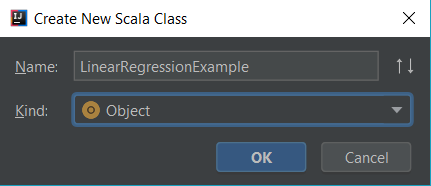

## Linear Regression with Scala / Spark

Use Spark's ML-lib to utilize in-built machine learning capabilities of Spark.

1. First step is to include ML-lib as a dependency in the pom.xml file. Use the following piece of code to include. Spark version being used here is Spark 2.3.

```xml
<dependency>
    <groupId>org.apache.spark</groupId>
    <artifactId>spark-mllib_2.11</artifactId>
    <version>2.3.0</version>
</dependency>
```

2. Next step is to create a Scala object file under *src/main/scala* directory. To do so, go to 'scala' folder, right click to access 'New' menu and select 'Scala Class' option to reach the dialog box as shown below.



3. Give it a meaningful name, select 'Object' as Kind and click OK. It creates a blank *LinearRegressionExample.scala* file with an Object created named *LinearRegressionExample.*

4. Create another directory under your project structure named 'data' and download any desired dataset in that directory. Here USA_Housing.csv dataset has been used for illustration purpose.

5. Next step is to import the following libraries by writing the following piece of code at the very beginning. 

   ```scala
   import org.apache.spark.sql.{DataFrame, SparkSession}
   import org.apache.spark.ml.regression.LinearRegression
   import org.apache.spark.ml.evaluation.RegressionEvaluator
   import org.apache.log4j._
   ```

   SparkSession aids in creating a SparkSession. DataFrame library utilized Spark DataFrame API which is a named column abstraction on top of Spark RDD.

   LinearRegression library is the main library for this example. RegressionEvaluator helps in evaluating how good the predictions are against the actual values using a pre-defined metrics such as *'mse', 'r2' or 'rmse'.*

   log4j library helps in suppressing unwanted warning and information from getting printed onto the console.

6. Next step is to load the dataset. Use the following lines of code for creating a spark session and importing dataset.

   ```scala
   Logger.getLogger("org").setLevel(Level.ERROR)
   val spark = SparkSession.builder().appName("LinearRegressionAlgorithm")
     						.master("local").getOrCreate()
   val df: DataFrame = spark.read.option("header", "true").option("inferSchema", "true")
    						.format("csv").load("data/USA_Housing.csv")
   import df.sqlContext.implicits._
   ```

7. Check out the datatype and structure of data before proceeding with modelling. The datatypes should match with the data in the corresponding column. With different datasets, different formatting might be required.

   ```scala 
   df.printSchema()
   df.show()
   println("Number of Columns:"+df.columns.toSeq.size)
   println("Number of Datapoints:"+df.count())
   ```

8. If any, null rows can be removed using na.drop() method available with Spark Data Frames. There are 2 arguements:

   "*any*": remove rows if any of the column is null

   "*all*": remove rows if all the columns are null

   ```scala 
   //Remove missing value or NULL rows
   val removeNullDF = df.na.drop("any")
   ```

9. If there are any categorical columns in the dataset, then all such columns are required to be indexed using *StringIndexers*. One-Hot Encoding can't be used as it has been deprecated from Spark 2.3 onwards. Multiple statements would be required for multiple categorical columns.

   ```scala
   import org.apache.spark.ml.feature.StringIndexer
   val featureIndexer = new StringIndexer()
     .setInputCol("Feature_1")
     .setOutputCol("indexedFeature_1")
   val indexedDF = featureIndexer.fit(removeNullDF).transform(removeNullDF)
   ```

10. All the features are required to be assembled into a format suitable for ML-lib to work upon. This is achieved through *VectorAssembler* library. All the features in the dataset are compacted into a single column separated by commas. The response column makes the second column of the assembled dataset.

    ```scala 
    import org.apache.spark.ml.feature.VectorAssembler
    val featureList = FilteredDF.columns.filterNot(x=> x.toString=="label")
    val assembler = new VectorAssembler().setInputCols(featureList).setOutputCol("features")
    val assembledDF = assembler.transform(indexedDF)
    ```

11. Split the dataset into training and test sets. Use the following piece of code for spliting the data.

    ```scala
    // Split the data into training and test sets (30% held out for testing).
    val Array(trainingData, testData) = assembledDF.randomSplit(Array(0.7, 0.3))
    ```

12. Next step is to build a linear regression object and set the features column and response column. This features column is the one which is assembled in the previous step.

    ```scala 
    val lr = new LinearRegression()
    			.setFeaturesCol("features")
    			.setLabelCol("label")
    			.fitIntercept(true)
    	         .setMaxIter(10)
                 .setRegParam(0.3)
                 .setElasticNetParam(0.8)
    
    // Fit the model
    val lrModel = lr.fit(trainingData)
    val predDF = lrModel.transform(testData).select("label", "features","prediction")
    ```

13. Model summary with the *trainingData* can be printed with the code given below:

    ```scala 
    // Print the coefficients and intercept for linear regression
    println(s"Coefficients: ${lrModel.coefficients} Intercept: ${lrModel.intercept}")
    
    // Summarize the model over the training set and print out some metrics
    val trainingSummary = lrModel.summary
    println(s"numIterations: ${trainingSummary.totalIterations}")
    println(s"objectiveHistory: [${trainingSummary.objectiveHistory.mkString(",")}]")
    trainingSummary.residuals.show()
    println(s"RMSE: ${trainingSummary.rootMeanSquaredError}")
    println(s"r2: ${trainingSummary.r2}")
    ```

14. Final step is to evaluate the predictions from the model on *testData*. An evaluator is required to evaluate the predictions of the model on *testData*. *RegressionEvaluator* library helps in doing so.

    ```scala 
    import org.apache.spark.ml.evaluation.RegressionEvaluator
     val lr_evaluator = new RegressionEvaluator()
                            .setMetricName("mse")
                            .setPredictionCol("prediction")
                            .setLabelCol("label")
    println("mse:" + regressionEvaluator.setMetricName("mse").evaluate(predDF))
    println("rmse:" + regressionEvaluator.setMetricName("rmse").evaluate(predDF))
    println("mae:" + regressionEvaluator.setMetricName("mae").evaluate(predDF))
    ```

Full linear regression script can be found 

[here]: https://bitbucket.micron.com/bbdc/projects/FDS/repos/micapro_ttmy65d/browse/src/main/scala/com/micron/mica/LinearRegressionMICA.scala.

